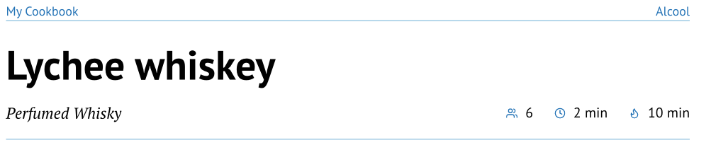

# Fancy Cookbook

Inspired by the excellent [Chef-cookbook by PaulMue0](https://github.com/Paulmue0/chef-cookbook/tree/main) but with a lot of differences.

So this is a template to write some recipes in a coherent cookbook with beautiful colors, annexes, indexes, and other stuffs in your language.

## How to use it ?

You can use this template in the Typst web app by clicking "Start from template" on the dashboard and searching for `fancy-cookbook`.

Alternatively, you can use the CLI:

```bash
typst init @preview/fancy-cookbook
```

## What's in it ?

There is different functions to make your cookbook :
* **recipe** : This function will help you write recipes with a very simple syntax, but it has advanced function too to customize the render.
* **cookbook** : This function will help you for the book itself, it's the most important part. All of this needs the usage of *cookbook* and *recipe*.
You'll use this one before everything else, but for a better comprehension, I will describe this one after the *recipe*.
* **notARecipe** : This one is here to help you write text in sections that not look like the recipes (there is more space here).
* **set-theme** : This function can change the colors of the next chapters and recipes.
* **cover-image** : This one will help you put a cover image with a good integration to the cookbook.
* **back-cover-image** : This one is the same as the previous but for the back cover.

## Recipe

Minimal syntax to use it with an example :

```typ
#recipe(
  [Lychee whiskey],
  description: [Perfumed Whisky],
  servings: 6,
  prep-time: [2 min],
  cook-time: [10 min],
  ingredients: [
    - *1 l* flask empty and clean
    - *350 ml* of whisky
    - *150 g* of sugar
    - *1* vanilla stick
    - Some lychees
  ],
  instructions: [
    + Put the whisky, the sugar and the vanilla stick in the flask.
    + Add lychees in it the flask until the flask is full.
    + Leave to macerate.
  ]
)
```
The first part, with the name, the description, servings, prep-time and cook-time is for the header part of the recipe that you can see here :



You can see the page header with the book's title on left and chapter title on right and a line to separate from the header of the recipe which is also closed by a line

The second mandatory part is **ingredients** witch as you can see is a content with a list.
The third mandatory part is **instructions** witch is a content with a numbered list.

This two parts wil be separate in two columns. And all the body part of the recipe will be in the left or the right column. Here it is :


That's it for the simplest recipe, but we have other options. First of all we can have groups of ingredients and groups of instructions.

### Groups of Ingredients or Instructions

```typ
#recipe([Something Cool],
  description: [An imaginary recipe],
  servings: 6,
  prep-time: [2 min],
  cook-time: [10 min],
  ingredients: (
    (
      title: [Dough],
      items: [
        - Some flour
        - Eggs
      ]
    ),
    (
      title: [Trim],
      items: [
        - Mandragora roots
        - Chili powder
        - Sugar
      ]
    )
  ),
  instructions: (
    (
      title: [Dough],
      steps: [
        + Put all together and mix
        + Cast a hot spell to make it burns
      ]
    ),
    (
      title: [Garnish],
      steps: [
        + Mix all together
        + And put all of these in the garbage
      ]
    )
  )
)
```

So you can see that we have replaced the content with lists of dictionaries. The two known dictionaries have a key named *title*.
For the ingredients, the key *items* will accept a content with a list, as it was before.
For the instructions, the key *steps* will accept a content with a numbered as it was before.

And the result is :


As you can see the numbering continue event if the lists are in different groups.

### Other optional properties

#### *image-left* and *image-right*

```typ
#recipe(
  [Lychee whiskey],
  description: [Perfumed Whisky],
  image-left: image("asset/whisky.png)  // image-right or both
  ...
```
You can add images to the recipe, on is for the left column and the other for the right one. This option can let you adjust your recipe to fit in one page if you want.

#### *notes* and *notes-right*
```typ
#recipe(
  [Lychee whiskey],
  description: [Perfumed Whisky],
  notes: [If you add some coriander at the end, il will be amazing.]
  ...
```
notes will be placed in a block in the left column.
This is the default behavior and that's why it's not named notes-left.
But sometimes, the only way for the recipe to fit in one page is to have notes on the right side, so you have $notes-right*

#### *author*
If you want like me to tell, recipe by recipe, who is the author like your grandmother this property is for you.

```typ
#recipe(
  [Banana Jam],
  description: [Sweet Jam],
  author: [GrandMa]
  ...
```

#### *label*

This one is very important for me. You can add a label for your recipe and use this as reference in other recipe.
For example, you have a recipe for Pizza Dough and different pizza recipes.
In the ingredients part of each of them you can reference the first recipe ant the reference will be replaced by somthing like this "Pizza Douch(p 17)".

Here si a small example of usage.

```typ
#recipe(
  [Banana Jam],
  description: [Sweet Jam],
  label: <bananaJam>
  ...
  
  
#recipe(
    [Other],
    ingredients: [
        - @bananajam
    ...
```


#### *tags*
The tags will not be seen in the recipe but will be used to create indexes that we will see in the *cookbook* part.
But one thing to know is that if you put only one tag in a recipe, you'll have an appendices part with an index at the end of the book.

```typ
#recipe(
  [Banana Jam],
  description: [Sweet Jam],
  tags: ("Banana", "Sweet", "Breakfast")
  ...
```

I prefer to use to dictionaries for my tags, it can help you avoid mistakes (different spelling). Here is an example :

```typ
#let country = (
    france: "France",
    spain: "Spain"
)

#recipe(
  [Banana Jam],
  description: [Sweet Jam],
  tags: (country.spain)
  ...
  
  
  #recipe(
  [Paella],
  description: [Very good],
  tags: (country.spain)
  ...
```

And you will see how it can help you build custom indexes in the *cookbook* part.


